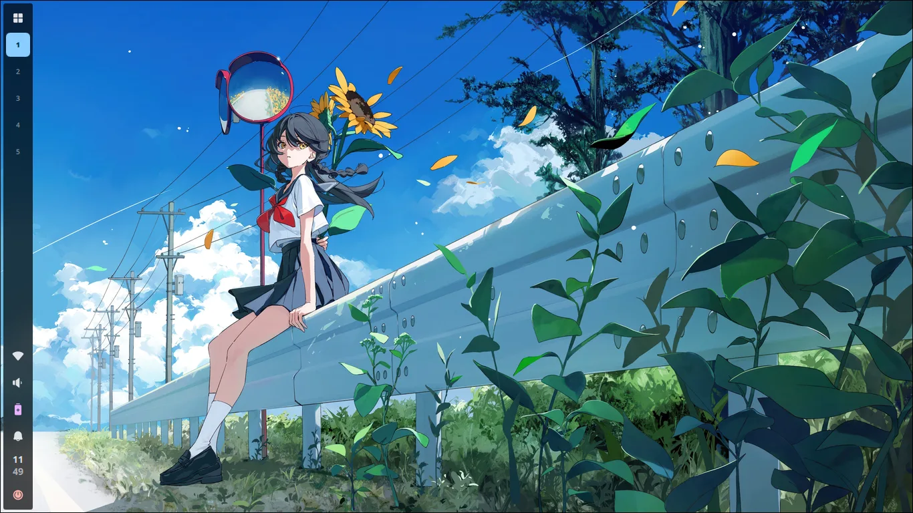
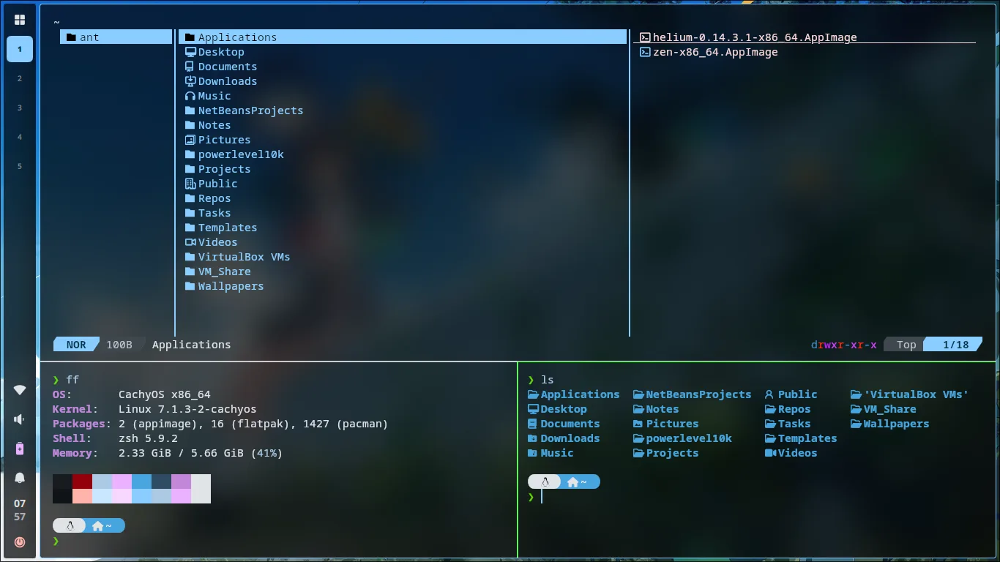
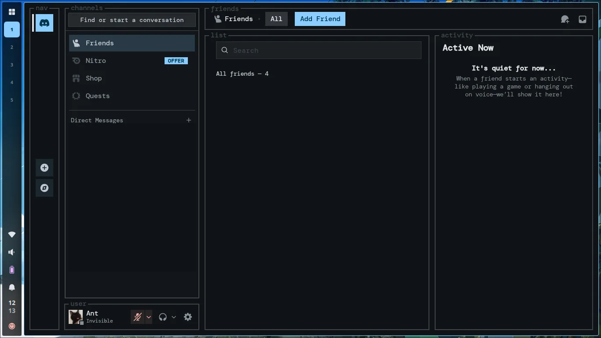
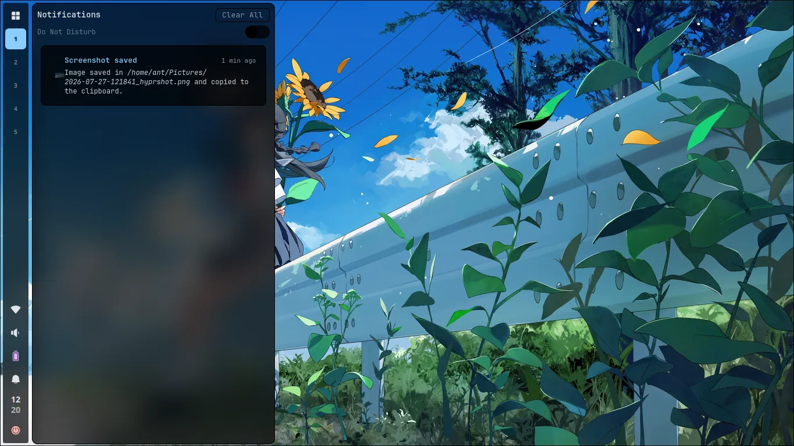
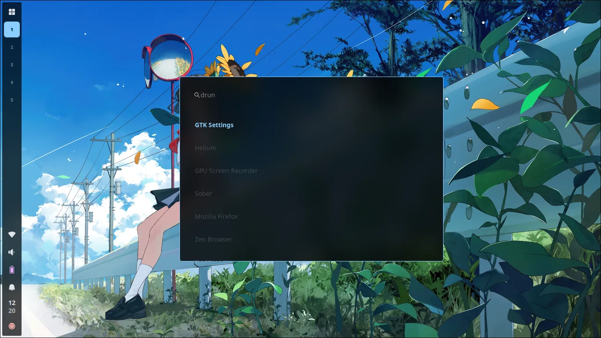
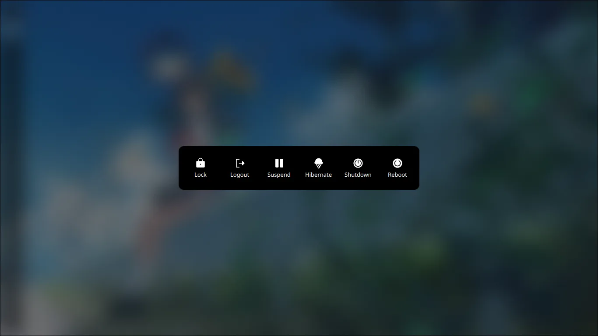
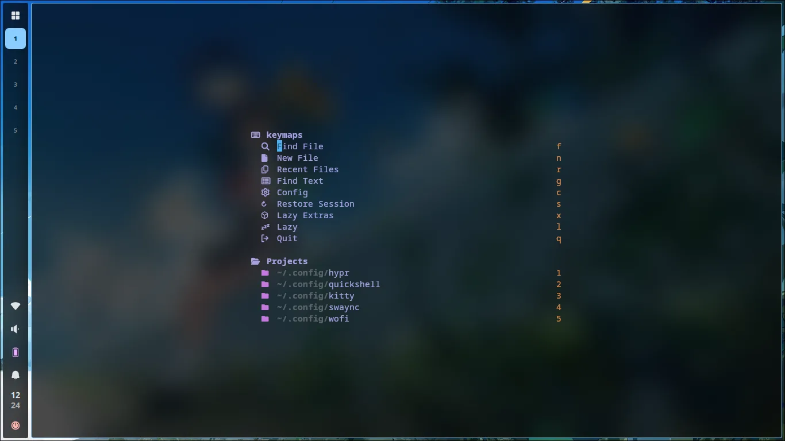
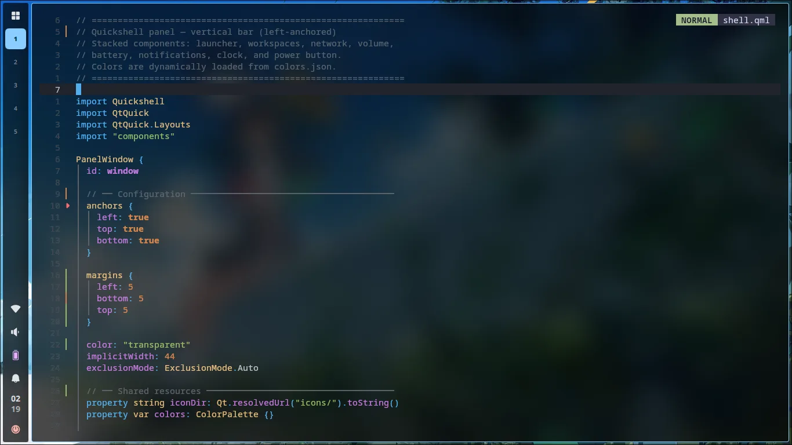

# CODERANT DOTFILES


A modern, fast, and visually cohesive dotfiles collection for **CachyOS** powered by **Hyprland**, featuring **Material You (MD3)** dynamic color theming that adapts to your wallpaper.



## Features

- **Dynamic Material You Theming** — Colors extracted from your wallpaper via `matugen` propagate to every component: Hyprland, Kitty, Swaync, Wofi, Yazi, Neovim, Quickshell, Vesktop (Discord), and OpenCode.
- **Quickshell Panel** — A polished, reactive taskbar and OSD built with QML, featuring workspaces, volume, brightness, network, battery, notifications, clock, and power menu.
- **LazyVim Neovim** — Fully featured Neovim setup with 50+ plugins, custom dashboard, and multiple colorschemes.
- **Wayland Native** — All applications configured to run natively on Wayland for optimal performance.

## Gallery

<details>
  <summary>Zen Browser</summary>
  
</details>
<details>
  <summary>Kitty</summary>
  
</details>
<details>
  <summary>Discord</summary>
  
</details>
<details>
  <summary>Wifi, Btop & Pulsemixer</summary>
  
</details>
<details>
  <summary>Notifications</summary>
  
</details>
<details>
  <summary>Launcher</summary>
  
</details>
<details>
  <summary>Power Menu</summary>
  
</details>
<details>
  <summary>Neovim</summary>
  
</details>
<details>
  <summary>Neovim Editing</summary>
  
</details>

## Components

| Component                                                          | Description                                                         |
| ------------------------------------------------------------------ | ------------------------------------------------------------------- |
| **[Hyprland](https://hyprland.org)**                               | Wayland compositor with Lua-based modular config                    |
| **[Quickshell](https://quickshell.org)**                           | Qt-based panel bar, OSD (volume/brightness), and wlogout power menu |
| **[Kitty](https://sw.kovidgoyal.net/kitty/)**                      | GPU-accelerated terminal with dynamic wallpaper-based theme         |
| **[Neovim](https://neovim.io)**                                    | Editor with LazyVim framework                       |
| **[Swaync](https://github.com/ErikReider/SwayNotificationCenter)** | Notification center with MD3 styling                                |
| **[Wofi](https://hg.sr.ht/~scoopta/wofi)**                         | Application launcher with custom theming                            |
| **[Yazi](https://yazi-rs.github.io)**                              | Terminal file manager with Nerd Font icons                          |
| **[Hyprlock](https://github.com/hyprwm/hyprlock)**                 | Lockscreen with blurred wallpaper, clock, and status indicators     |
| **[Hypridle](https://github.com/hyprwm/hypridle)**                 | Idle management daemon (dim → lock → suspend)                       |
| **[Hyprshot](https://github.com/Gustash/Hyprshot)**                | Screenshot utility (region, window, fullscreen)                     |
| **[Btop](https://github.com/aristocratos/btop)**                   | System resource monitor                                             |
| **[Fastfetch](https://github.com/fastfetch-cli/fastfetch)**        | System information display                                          |
| **[Thunar](https://docs.xfce.org/xfce/thunar/start)**              | GUI file manager                                                    |
| **[Zen Browser](https://zen-browser.app)**                        | Browser with custom mods |

## Installation

Clone the repository:

```bash
git clone --depth 1 https://github.com/Ant0nioVG/CODERANT.git ~/CODERANT
cd ~/CODERANT
```

> See [Install.md](Install.md) for dependencies and setup instructions.

## Keybindings

All keybindings are documented in [Config/hypr/KEYBINDS.md](Config/hypr/KEYBINDS.md).

## Directory Structure

```
.
├── Config/
│   ├── hypr/           # Hyprland WM (Lua)
│   ├── kitty/          # Terminal emulator
│   ├── nvim/           # Neovim (LazyVim overrides)
│   ├── quickshell/     # Panel bar, OSD, wlogout (QML)
│   ├── swaync/         # Notification center
│   ├── wofi/           # Application launcher
│   ├── yazi/           # File manager
│   ├── skwd-wall/      # Wallpaper + Matugen theming
│   ├── btop/           # System monitor
│   ├── fastfetch/      # System info
│   └── zen/            # Zen Browser mods export
├── Home/
│   └── .zshrc          # Zsh configuration
├── Images/             # Screenshots
├── Install.md          # Installation guide
└── README.md           # This file
```

## Credits

The Matugen color templates in `Config/skwd-wall/data/matugen/templates/` are based on the examples from [InioX/matugen-themes](https://github.com/InioX/matugen-themes) (MIT License), specifically for Yazi and OpenCode. See [LICENSE-MATUGEN-THEMES](Config/skwd-wall/data/matugen/templates/LICENSE-MATUGEN-THEMES).

The Kitty template (`Config/skwd-wall/data/matugen/templates/kitty.conf`) is based on the default templates from [liixini/skwd-wall](https://github.com/liixini/skwd-wall) (MIT License). See [LICENSE-SKWD-WALL](Config/skwd-wall/data/matugen/templates/LICENSE-SKWD-WALL).

The icons in `Config/quickshell/` (Quickshell panel and wlogout power menu) are from [Phosphor Icons](https://phosphoricons.com) (MIT License). See [LICENSE-ICONS](Config/quickshell/icons/LICENSE-ICONS) and [LICENSE-ICONS](Config/quickshell/wlogout/icons/LICENSE-ICONS).

The power menu in `Config/quickshell/wlogout/` is based on the official examples from [quickshell-examples](https://git.outfoxxed.me/quickshell/quickshell-examples), modified with dynamic Material You color support and a custom UI.

The Neovim configuration in `Config/nvim/` overrides the [LazyVim](https://github.com/LazyVim/LazyVim) framework (Apache License 2.0), which is installed externally. See [Install.md](Install.md).
